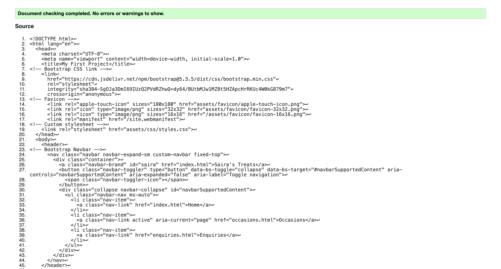

## How to View the Project
- [View the deployed website](https://luqmaan-io.github.io/my-first-project/)

# About Saira's Treats
Saira's Treats is a website for a already established small business for my wife who bakes part-time but at a professioanl level. Right now the website is in its very basic form with there currently being 3 current sections. 

This project is the first of mine and has allowed me to explore my HTML and CSS skills as well as learning about Bootsrap - the first library i've explored.

# Site contents
- Home Page. A litte introduction into what Saira's treats is and what she does.
- Occasions Page. Describes to site visitors the different types of occasions she caters for.
- Enquiries Page. Presents a form for site visitors to fill in if they wished to make an enquiry to Saira's treats regarding a bake.

# Project Purpose
The purpose of this project is to showcase and promote handmade baked cakes and other goods. The focus is primarily on bespoke cakes whilst also providing an easy, elegant way for customers to enquire about an order (and in a later version, to be able to place orders online).

# UX
### Overview
Saira's Treats is developed with the following desgin and functionality in mind:

- Minamilistic: Site is simple with clear call to action buttons presented.
- Modern aesthetic: Clean responsive layout.
- Mobile-friendly: Responsive design making it suitable for everyone, everywhere.

### Accessability
The website has largely taken accessability in mind to cater to as many people as possible.

- Use of semantic HTML tags
- Responsive design that changes to all screen sizes seamlessly.
- Aria labels and alt text that provide clear descriptons.

# User stories
### As a new customer

1. I want to know what it is that the business makes.
    So that I can know whether they can cater to what I need.

2. I want to be able to find Saira's treats' social media easily.
    So that I can keep up to date and see more of their products.

3. I want to be able to make an enquiry.
    So that I can easily ask for a custom cake or treat.

### As the site owner (Saira)

1. I want to receive enquiries by email or form submission.
    So that I can easily I can respond quickly and track potential orders.

2. I want traffic to flow through the website. 
    So that I can tranisition everything over to the site and have everything in one place.

### As a developer 

1. I want clean and organized code.
    So that I can maintain the website easily and understand what I have done.

# Design choices
## The following colours have been chosen with accessability taken into mind. They offer good readability and provide a strong balance between a luxury aesthetic and usability.

- Jet Black (#1A1A1A) Text colour
- Dark Goldenrod (#B8860B) Used for Hero text 
- Platinum Silver (#E5E4E2) Used for background colour in header and footer as well as background colour for cards.
- White Smoke (#F5F5F5) Used for background colour of body
 
## Fonts

### Great Vibes
- used for main heading on every page. It offers a elegant and luxurious appearance that enhances the feeling of the brand.

### Lato
- Used for all other text on the website. A cllean, professional font style that has great readability.

# CSS validated using Official Jigsaw validator

CSS ran through Jigsaw validator shows no errors found in the code.

# HTML validated using W3C validator

index.html shows no errors

occasions.html shows no errors

enquiries.html shows no errors

